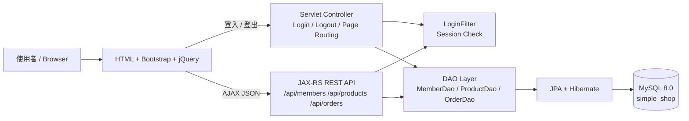
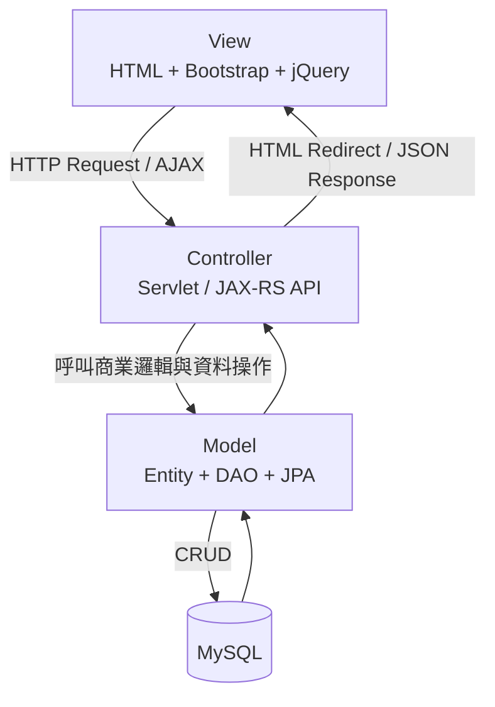
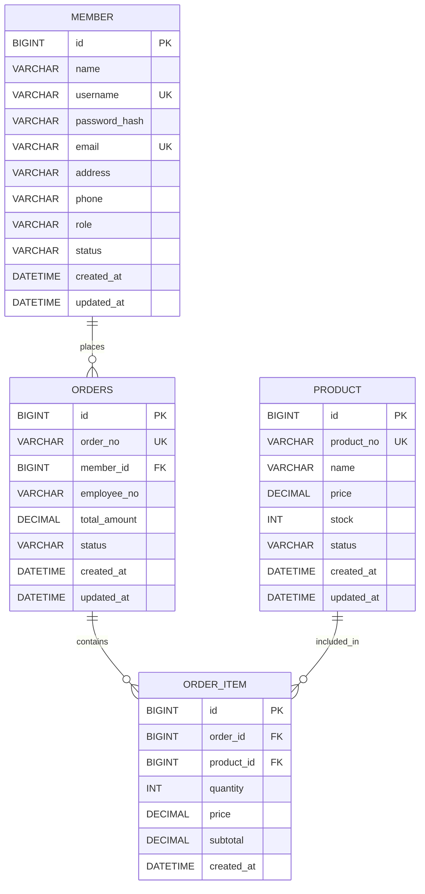
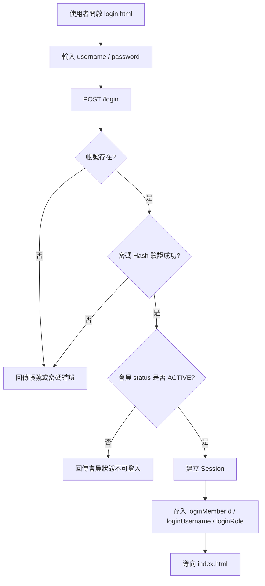
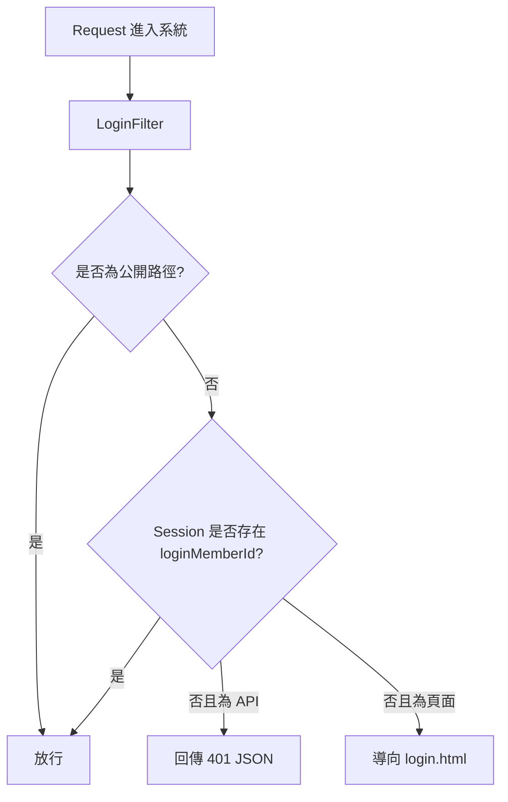
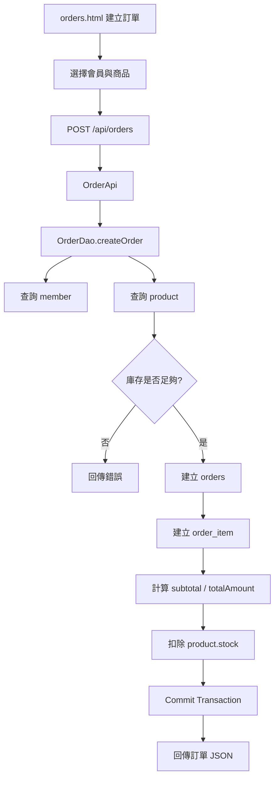

# SimpleShop_MavenWebProject

## 1. 專案名稱與簡介

**SimpleShop_MavenWebProject** 是一個以 **Java Web / Jakarta EE** 為核心開發的簡易購物管理系統，採用 **Eclipse Maven Web Project** 結構，整合 **Servlet、JAX-RS RESTful API、JPA/Hibernate、MySQL、jQuery AJAX、Bootstrap**。

本專案主要目標是練習 Java Web 後端完整流程，包含會員註冊、會員登入、Session 權限控管、會員 CRUD、商品 CRUD、訂單 CRUD、RESTful API 設計，以及前後端 AJAX 串接。

適合作為 Java Web、Servlet、JPA、RESTful API、MySQL CRUD 的學習作品，也可以作為面試時展示 MVC、DAO Pattern、REST API 與資料庫設計能力的練習專案。

---

## 2. 專案特色（面試重點）

- 使用 **JDK 17** 開發，符合現代 Java LTS 版本。
- 使用 **Maven Web Project** 管理依賴與 WAR 打包。
- 使用 **Jakarta Servlet** 處理登入、登出、Session 與頁面導向。
- 使用 **LoginFilter** 實作 Session 權限控管，未登入者無法進入系統頁面與受保護 API。
- 使用 **JAX-RS / Jersey** 建立 RESTful API，支援 Tomcat 10.1 與 TomEE 10.1。
- 使用 **JPA + Hibernate** 操作 MySQL，將資料庫操作封裝在 DAO 層。
- 使用 **DAO Pattern** 分離資料存取邏輯，降低 Controller / API 與資料庫耦合。
- 使用 **DTO** 回傳前端需要的資料，避免直接暴露 Entity 與密碼欄位。
- 使用 **SHA-256 password_hash** 儲存密碼雜湊，避免資料庫存明文密碼。
- 使用 **jQuery AJAX** 呼叫後端 REST API，實作前後端分離式資料互動。
- 使用 **Bootstrap** 建立簡潔的管理後台畫面。
- 訂單建立時會計算商品小計、訂單總金額，並扣除商品庫存。
- 保留 `role` 欄位，後續可擴充 ADMIN / USER 權限分流。

---

## 3. 技術架構

| 分類 | 技術 |
|---|---|
| Language | Java 17 |
| IDE | Eclipse IDE |
| Project Type | Maven Web Project |
| Server | Apache Tomcat 10.1 / TomEE 10.1 |
| Servlet API | Jakarta Servlet |
| REST API | Jakarta REST / JAX-RS + Jersey |
| ORM | JPA + Hibernate |
| Database | MySQL 8.0 |
| Pattern | MVC + DAO Pattern |
| Frontend | HTML、CSS、Bootstrap |
| AJAX | jQuery AJAX |
| Build Tool | Maven |
| Package | WAR |

---

## 4. 系統架構圖（System Architecture）



系統分成三個主要區塊：

1. **前端頁面層**：HTML、Bootstrap、jQuery AJAX。
2. **後端 Web 層**：Servlet、LoginFilter、JAX-RS REST API。
3. **資料存取層**：DAO、JPA/Hibernate、MySQL。

---

## 5. MVC 架構圖



### MVC 對應說明

| MVC | 專案對應 |
|---|---|
| Model | `entity`、`dao`、`dao.impl`、`util.JpaUtil` |
| View | `login.html`、`register.html`、`index.html`、`members.html`、`products.html`、`orders.html` |
| Controller | `controller` Servlet、`rest` JAX-RS API |

---

## 6. ER Diagram（資料庫設計）



### 資料表功能說明

| 資料表 | 功能 |
|---|---|
| `member` | 儲存會員帳號、密碼雜湊、角色、狀態與基本資料 |
| `product` | 儲存商品編號、商品名稱、價格、庫存與狀態 |
| `orders` | 儲存訂單主檔，例如訂單編號、會員、總金額、狀態 |
| `order_item` | 儲存訂單明細，例如商品、數量、單價、小計 |

### 關聯說明

- 一個會員可以建立多張訂單：`member 1 : N orders`
- 一張訂單可以包含多筆明細：`orders 1 : N order_item`
- 一個商品可以出現在多筆訂單明細中：`product 1 : N order_item`

---

## 7. 專案目錄結構

```text
SimpleShop_MavenWebProject
├─ pom.xml
├─ README.md
├─ database
│  └─ schema.sql
│
├─ src
│  └─ main
│     ├─ java
│     │  └─ backEnd
│     │     ├─ entity
│     │     │  ├─ Member.java
│     │     │  ├─ Product.java
│     │     │  ├─ Orders.java
│     │     │  └─ OrderItem.java
│     │     │
│     │     ├─ dao
│     │     │  ├─ MemberDao.java
│     │     │  ├─ ProductDao.java
│     │     │  ├─ OrderDao.java
│     │     │  └─ impl
│     │     │     ├─ MemberDaoImpl.java
│     │     │     ├─ ProductDaoImpl.java
│     │     │     └─ OrderDaoImpl.java
│     │     │
│     │     ├─ controller
│     │     │  ├─ LoginController.java
│     │     │  ├─ MemberController.java
│     │     │  ├─ ProductController.java
│     │     │  └─ OrderController.java
│     │     │
│     │     ├─ rest
│     │     │  ├─ RestApplication.java
│     │     │  ├─ MemberApi.java
│     │     │  ├─ ProductApi.java
│     │     │  ├─ OrderApi.java
│     │     │  ├─ GenericExceptionMapper.java
│     │     │  └─ ObjectMapperProvider.java
│     │     │
│     │     ├─ filter
│     │     │  └─ LoginFilter.java
│     │     │
│     │     └─ util
│     │        ├─ JpaUtil.java
│     │        ├─ PasswordUtil.java
│     │        └─ JsonUtil.java
│     │
│     ├─ resources
│     │  └─ META-INF
│     │     └─ persistence.xml
│     │
│     └─ webapp
│        ├─ WEB-INF
│        │  └─ web.xml
│        ├─ assets
│        │  └─ js
│        │     └─ common.js
│        ├─ login.html
│        ├─ register.html
│        ├─ index.html
│        ├─ members.html
│        ├─ products.html
│        └─ orders.html
```

> 注意：如果你的版本還沒有 `ObjectMapperProvider.java`，請參考「遇到的問題與解決方案」中的 LocalDateTime JSON 解法補上。

---

## 8. 資料庫 Schema

檔案位置：

```text
database/schema.sql
```

完整 Schema：

```sql
CREATE DATABASE IF NOT EXISTS simple_shop
    DEFAULT CHARACTER SET utf8mb4
    DEFAULT COLLATE utf8mb4_unicode_ci;

USE simple_shop;

DROP TABLE IF EXISTS order_item;
DROP TABLE IF EXISTS orders;
DROP TABLE IF EXISTS product;
DROP TABLE IF EXISTS member;

CREATE TABLE member (
    id BIGINT PRIMARY KEY AUTO_INCREMENT,
    name VARCHAR(100) NOT NULL,
    username VARCHAR(100) NOT NULL UNIQUE,
    password_hash VARCHAR(255) NOT NULL,
    email VARCHAR(150) UNIQUE,
    address VARCHAR(255),
    phone VARCHAR(30),
    role VARCHAR(20) NOT NULL DEFAULT 'USER',
    status VARCHAR(20) NOT NULL DEFAULT 'ACTIVE',
    created_at DATETIME DEFAULT CURRENT_TIMESTAMP,
    updated_at DATETIME DEFAULT CURRENT_TIMESTAMP ON UPDATE CURRENT_TIMESTAMP
);

CREATE TABLE product (
    id BIGINT PRIMARY KEY AUTO_INCREMENT,
    product_no VARCHAR(50) NOT NULL UNIQUE,
    name VARCHAR(100) NOT NULL,
    price DECIMAL(10,2) NOT NULL,
    stock INT NOT NULL DEFAULT 0,
    status VARCHAR(20) NOT NULL DEFAULT 'ACTIVE',
    created_at DATETIME DEFAULT CURRENT_TIMESTAMP,
    updated_at DATETIME DEFAULT CURRENT_TIMESTAMP ON UPDATE CURRENT_TIMESTAMP
);

CREATE TABLE orders (
    id BIGINT PRIMARY KEY AUTO_INCREMENT,
    order_no VARCHAR(50) NOT NULL UNIQUE,
    member_id BIGINT NOT NULL,
    employee_no VARCHAR(50),
    total_amount DECIMAL(10,2) NOT NULL DEFAULT 0,
    status VARCHAR(20) NOT NULL DEFAULT 'NEW',
    created_at DATETIME DEFAULT CURRENT_TIMESTAMP,
    updated_at DATETIME DEFAULT CURRENT_TIMESTAMP ON UPDATE CURRENT_TIMESTAMP,
    FOREIGN KEY (member_id) REFERENCES member(id)
);

CREATE TABLE order_item (
    id BIGINT PRIMARY KEY AUTO_INCREMENT,
    order_id BIGINT NOT NULL,
    product_id BIGINT NOT NULL,
    quantity INT NOT NULL,
    price DECIMAL(10,2) NOT NULL,
    subtotal DECIMAL(10,2) NOT NULL,
    created_at DATETIME DEFAULT CURRENT_TIMESTAMP,
    FOREIGN KEY (order_id) REFERENCES orders(id),
    FOREIGN KEY (product_id) REFERENCES product(id)
);
```

### 預設測試資料

```sql
INSERT INTO member (name, username, password_hash, email, address, phone, role, status)
VALUES
('系統管理員', 'admin', '03ac674216f3e15c761ee1a5e255f067953623c8b388b4459e13f978d7c846f4', 'admin@example.com', 'Taipei', '0911111111', 'ADMIN', 'ACTIVE'),
('測試會員', 'user', '03ac674216f3e15c761ee1a5e255f067953623c8b388b4459e13f978d7c846f4', 'user@example.com', 'Taipei', '0922222222', 'USER', 'ACTIVE');

INSERT INTO product (product_no, name, price, stock, status)
VALUES
('P001', 'Java 入門書', 550.00, 20, 'ACTIVE'),
('P002', 'MySQL 練習本', 480.00, 15, 'ACTIVE'),
('P003', 'Bootstrap 範例包', 300.00, 30, 'ACTIVE');
```

### 預設登入帳號

| 角色 | 帳號 | 密碼 |
|---|---|---|
| 系統管理員 | `admin` | `1234` |
| 測試會員 | `user` | `1234` |

> 目前 `ADMIN` 與 `USER` 角色欄位已存在，但系統主要是判斷是否登入。完整角色分流可作為未來優化。

---

## 9. 安裝與執行方式

### 9.1 環境需求

請先安裝：

- JDK 17
- Eclipse IDE for Enterprise Java and Web Developers
- Apache Tomcat 10.1 或 TomEE 10.1
- MySQL 8.0
- Maven

---

### 9.2 匯入 Eclipse

1. 開啟 Eclipse。
2. 選擇 `File` → `Import`。
3. 選擇 `Maven` → `Existing Maven Projects`。
4. 選擇 `SimpleShop_MavenWebProject` 專案資料夾。
5. 勾選 `pom.xml`。
6. 按下 `Finish`。
7. 匯入後右鍵專案，選擇 `Maven` → `Update Project`。

---

### 9.3 建立 MySQL 資料庫

使用 MySQL Workbench、DBeaver 或命令列執行：

```text
database/schema.sql
```

執行後會建立：

```text
simple_shop
```

---

### 9.4 修改資料庫連線

檔案位置：

```text
src/main/resources/META-INF/persistence.xml
```

預設設定：

```xml
<property name="jakarta.persistence.jdbc.url" value="jdbc:mysql://localhost:3306/simple_shop?useSSL=false&amp;allowPublicKeyRetrieval=true&amp;serverTimezone=Asia/Taipei&amp;characterEncoding=utf8"/>
<property name="jakarta.persistence.jdbc.user" value="root"/>
<property name="jakarta.persistence.jdbc.password" value=""/>
```

如果你的 MySQL root 有密碼，請修改：

```xml
<property name="jakarta.persistence.jdbc.password" value="你的密碼"/>
```

---

### 9.5 部署到 Tomcat / TomEE

1. Eclipse 開啟 `Servers` 視窗。
2. 新增 Apache Tomcat 10.1 或 TomEE 10.1。
3. 專案右鍵 → `Run As` → `Run on Server`。
4. 選擇剛剛建立的 Server。
5. 啟動後開啟：

```text
http://localhost:8080/SimpleShop_MavenWebProject/login.html
```

---

### 9.6 測試 REST API

登入後可測試：

```text
http://localhost:8080/SimpleShop_MavenWebProject/api/members
http://localhost:8080/SimpleShop_MavenWebProject/api/products
http://localhost:8080/SimpleShop_MavenWebProject/api/orders
```

---

## 10. 系統畫面

> 以下為系統畫面說明。若要放到 GitHub，建議將截圖放在 `docs/images/`，再把圖片路徑補進 README。

| 畫面 | 路徑 | 說明 |
|---|---|---|
| 登入頁 | `/login.html` | 輸入帳號與密碼，登入後建立 Session |
| 註冊頁 | `/register.html` | 新增會員帳號，密碼會轉成 Hash 後儲存 |
| 首頁 | `/index.html` | 系統功能入口，可前往會員、商品、訂單管理 |
| 會員管理 | `/members.html` | 查詢、新增、修改、刪除會員資料 |
| 商品管理 | `/products.html` | 查詢、新增、修改、刪除商品資料 |
| 訂單管理 | `/orders.html` | 建立訂單、查詢訂單、修改訂單狀態、刪除訂單 |

範例圖片語法：

```md


```

---

## 11. 功能流程圖

### 11.1 登入流程



### 11.2 Session 權限控管流程



### 11.3 商品 CRUD 流程

```mermaid
flowchart TD
    A[products.html] --> B[jQuery AJAX]
    B --> C[/api/products]
    C --> D[ProductApi]
    D --> E[ProductDao]
    E --> F[JPA / Hibernate]
    F --> G[(product table)]
    G --> F
    F --> E
    E --> D
    D --> H[JSON Response]
    H --> I[更新商品表格]
```

### 11.4 建立訂單流程



---

## 12. API 文件

Base URL：

```text
http://localhost:8080/SimpleShop_MavenWebProject/api
```

---

### 12.1 Member API

#### 查詢全部會員

```http
GET /api/members
```

Response：

```json
[
  {
    "id": 1,
    "name": "系統管理員",
    "username": "admin",
    "email": "admin@example.com",
    "address": "Taipei",
    "phone": "0911111111",
    "role": "ADMIN",
    "status": "ACTIVE",
    "createdAt": "2026-06-07T10:00:00",
    "updatedAt": "2026-06-07T10:00:00"
  }
]
```

#### 查詢單一會員

```http
GET /api/members/{id}
```

#### 新增會員

```http
POST /api/members
Content-Type: application/json
```

Request：

```json
{
  "name": "王小明",
  "username": "ming",
  "password": "1234",
  "email": "ming@example.com",
  "address": "Taipei",
  "phone": "0933333333",
  "role": "USER",
  "status": "ACTIVE"
}
```

#### 修改會員

```http
PUT /api/members/{id}
Content-Type: application/json
```

Request：

```json
{
  "name": "王小明",
  "username": "ming",
  "password": "",
  "email": "ming@example.com",
  "address": "New Taipei",
  "phone": "0933333333",
  "role": "USER",
  "status": "ACTIVE"
}
```

> 修改會員時，如果 `password` 空白，代表不修改密碼。

#### 刪除會員

```http
DELETE /api/members/{id}
```

---

### 12.2 Product API

#### 查詢全部商品

```http
GET /api/products
```

#### 查詢單一商品

```http
GET /api/products/{id}
```

#### 新增商品

```http
POST /api/products
Content-Type: application/json
```

Request：

```json
{
  "productNo": "P004",
  "name": "Servlet 教學書",
  "price": 620.00,
  "stock": 10,
  "status": "ACTIVE"
}
```

#### 修改商品

```http
PUT /api/products/{id}
Content-Type: application/json
```

Request：

```json
{
  "productNo": "P004",
  "name": "Servlet + JSP 教學書",
  "price": 680.00,
  "stock": 12,
  "status": "ACTIVE"
}
```

#### 刪除商品

```http
DELETE /api/products/{id}
```

---

### 12.3 Order API

#### 查詢全部訂單

```http
GET /api/orders
```

#### 查詢單一訂單

```http
GET /api/orders/{id}
```

#### 建立訂單

```http
POST /api/orders
Content-Type: application/json
```

Request：

```json
{
  "memberId": 1,
  "employeeNo": "E001",
  "items": [
    {
      "productId": 1,
      "quantity": 2
    },
    {
      "productId": 2,
      "quantity": 1
    }
  ]
}
```

Response：

```json
{
  "id": 1,
  "orderNo": "ORD202606070001",
  "memberId": 1,
  "memberName": "系統管理員",
  "employeeNo": "E001",
  "totalAmount": 1580.00,
  "status": "NEW",
  "items": [
    {
      "id": 1,
      "productId": 1,
      "productName": "Java 入門書",
      "quantity": 2,
      "price": 550.00,
      "subtotal": 1100.00
    },
    {
      "id": 2,
      "productId": 2,
      "productName": "MySQL 練習本",
      "quantity": 1,
      "price": 480.00,
      "subtotal": 480.00
    }
  ]
}
```

#### 修改訂單狀態

```http
PUT /api/orders/{id}/status
Content-Type: application/json
```

Request：

```json
{
  "status": "PAID"
}
```

#### 刪除訂單

```http
DELETE /api/orders/{id}
```

---

### 12.4 Login / Logout Servlet

#### 登入

```http
POST /login
Content-Type: application/x-www-form-urlencoded
```

Request：

```text
username=admin&password=1234
```

Response：

```json
{
  "success": true,
  "message": "登入成功",
  "username": "admin",
  "role": "ADMIN"
}
```

#### 登出

```http
GET /logout
```

---

## 13. 遇到的問題與解決方案

### 13.1 `/api/members` 出現 404

#### 問題

登入成功，但進入商品或會員頁時 AJAX 呼叫：

```text
/SimpleShop_MavenWebProject/api/members
```

出現：

```text
HTTP Status 404 – Not Found
```

#### 原因

Servlet 可以正常執行，但 REST API 沒有被掛載。若使用的是 Apache Tomcat 10.1，Tomcat 本身不內建 JAX-RS Runtime，因此需要加入 Jersey 並在 `web.xml` 設定 `/api/*`。

#### 解法

在 `pom.xml` 加入 Jersey：

```xml
<dependency>
    <groupId>org.glassfish.jersey.containers</groupId>
    <artifactId>jersey-container-servlet-core</artifactId>
    <version>3.1.8</version>
</dependency>
<dependency>
    <groupId>org.glassfish.jersey.inject</groupId>
    <artifactId>jersey-hk2</artifactId>
    <version>3.1.8</version>
</dependency>
<dependency>
    <groupId>org.glassfish.jersey.media</groupId>
    <artifactId>jersey-media-json-jackson</artifactId>
    <version>3.1.8</version>
</dependency>
```

並在 `WEB-INF/web.xml` 設定：

```xml
<servlet>
    <servlet-name>Jersey REST API</servlet-name>
    <servlet-class>org.glassfish.jersey.servlet.ServletContainer</servlet-class>
    <init-param>
        <param-name>jersey.config.server.provider.packages</param-name>
        <param-value>backEnd.rest</param-value>
    </init-param>
    <load-on-startup>1</load-on-startup>
</servlet>

<servlet-mapping>
    <servlet-name>Jersey REST API</servlet-name>
    <url-pattern>/api/*</url-pattern>
</servlet-mapping>
```

---

### 13.2 LocalDateTime 無法轉 JSON

#### 問題

REST API 回傳 DTO 時，若 DTO 內有：

```java
LocalDateTime createdAt;
LocalDateTime updatedAt;
```

可能出現：

```text
Java 8 date/time type java.time.LocalDateTime not supported by default
```

#### 原因

Jackson 預設不一定支援 Java 8 Date/Time API，需要加入 JSR310 module。

#### 解法

加入依賴：

```xml
<dependency>
    <groupId>com.fasterxml.jackson.datatype</groupId>
    <artifactId>jackson-datatype-jsr310</artifactId>
    <version>2.17.1</version>
</dependency>
```

建立 `ObjectMapperProvider.java`：

```java
package backEnd.rest;

import com.fasterxml.jackson.databind.ObjectMapper;
import com.fasterxml.jackson.databind.SerializationFeature;
import com.fasterxml.jackson.datatype.jsr310.JavaTimeModule;
import jakarta.ws.rs.ext.ContextResolver;
import jakarta.ws.rs.ext.Provider;

@Provider
public class ObjectMapperProvider implements ContextResolver<ObjectMapper> {

    private final ObjectMapper mapper;

    public ObjectMapperProvider() {
        mapper = new ObjectMapper();
        mapper.registerModule(new JavaTimeModule());
        mapper.disable(SerializationFeature.WRITE_DATES_AS_TIMESTAMPS);
    }

    @Override
    public ObjectMapper getContext(Class<?> type) {
        return mapper;
    }
}
```

---

### 13.3 忘記密碼怎麼辦？

#### 說明

資料庫中的 `password_hash` 不會儲存明文密碼，所以無法查回原本密碼。正確做法是「重設密碼」。

本專案測試密碼 `1234` 對應的 SHA-256 Hash：

```text
03ac674216f3e15c761ee1a5e255f067953623c8b388b4459e13f978d7c846f4
```

若要把 admin 密碼重設為 `1234`：

```sql
UPDATE member
SET password_hash = '03ac674216f3e15c761ee1a5e255f067953623c8b388b4459e13f978d7c846f4'
WHERE username = 'admin';
```

---

### 13.4 JPA 啟動時找不到資料表

#### 問題

啟動時出現 table not found 或 schema-validation error。

#### 原因

`persistence.xml` 使用：

```xml
<property name="hibernate.hbm2ddl.auto" value="validate"/>
```

代表 Hibernate 只驗證資料表，不會自動建立資料表。

#### 解法

請先執行：

```text
database/schema.sql
```

---

### 13.5 Eclipse 部署後仍然是舊版本

#### 問題

明明修改了程式，但 Tomcat 執行結果還是舊的。

#### 解法

1. 專案右鍵 → `Maven` → `Update Project`。
2. `Servers` 視窗中移除舊的專案部署。
3. 對 Server 按右鍵 → `Clean`。
4. 重新 `Add and Remove` 加入專案。
5. 重新啟動 Server。

---

## 14. 未來優化方向

目前此專案是 Java Web CRUD 練習版，後續可以擴充：

- **角色權限控管**：讓 `ADMIN` 可管理會員、商品、訂單；`USER` 只能查看商品與自己的訂單。
- **BCrypt 密碼加密**：取代 SHA-256，讓密碼儲存更接近正式系統。
- **忘記密碼功能**：加入 reset token、Email 驗證、密碼重設流程。
- **表單驗證強化**：前端與後端都加入更完整的 validation。
- **分頁與搜尋**：會員、商品、訂單列表加入 pagination 與 keyword search。
- **訂單狀態流程**：加入 `NEW → PAID → SHIPPED → COMPLETED → CANCELLED` 狀態轉換限制。
- **庫存交易安全**：處理多人同時下單時的庫存一致性問題。
- **軟刪除**：刪除會員或商品時改成更新 status，而不是直接刪除資料。
- **Service Layer**：在 Controller/API 與 DAO 中間加入 Service，讓商業邏輯更集中。
- **Spring Boot 版本**：未來可改寫成 Spring Boot + Spring Data JPA + Spring Security。
- **部署到雲端**：可部署到 AWS EC2 / Elastic Beanstalk，資料庫改用 AWS RDS MySQL。
- **Docker 化**：加入 Dockerfile 與 docker-compose，讓 Tomcat + MySQL 可以一鍵啟動。
- **API 文件工具**：導入 OpenAPI / Swagger UI。
- **單元測試**：加入 JUnit、Mockito、REST API 測試。

---

## 15. 個人學習收穫

透過本專案，我練習並理解了 Java Web 系統從前端到後端再到資料庫的完整流程：

1. 理解 Maven Web Project 的標準目錄與 WAR 部署方式。
2. 理解 Servlet 如何處理登入、登出、Session 與頁面導向。
3. 理解 Filter 如何在請求進入系統前做登入檢查。
4. 理解 RESTful API 的設計方式，包含 GET、POST、PUT、DELETE。
5. 理解 jQuery AJAX 如何與後端 API 串接並更新畫面。
6. 理解 JPA Entity 與 MySQL 資料表的對應關係。
7. 理解 DAO Pattern 如何封裝資料庫 CRUD 操作。
8. 理解會員、商品、訂單、訂單明細之間的資料表關聯。
9. 理解密碼不應儲存明文，而應儲存 password hash。
10. 理解 Tomcat 與 TomEE 的差異，特別是 JAX-RS Runtime 是否內建。
11. 理解 Jackson 在處理 `LocalDateTime` 時需要 JavaTimeModule。
12. 理解專案從 Dynamic Web Project 轉成 Maven Web Project 時，依賴、目錄與部署設定都需要正確配置。

本專案雖然是簡易購物系統，但涵蓋 Java Web 開發中常見的核心觀念，包含 MVC、DAO、REST API、Session、JPA、MySQL 與前後端 AJAX 串接，是後續學習 Spring Boot、Spring Security、雲端部署與高併發交易系統的重要基礎。
