# SimpleShop_MavenWebProject

## 1. 專案名稱與簡介

**SimpleShop_MavenWebProject** 是一個以 **Java Web / Jakarta EE** 為核心開發的簡易購物管理系統，採用 **Eclipse Maven Web Project** 結構，整合 **Servlet、Filter、JAX-RS RESTful API、JPA/Hibernate、MySQL、jQuery AJAX、Bootstrap**。

本專案主要實作購物系統後台常見功能，包含：會員註冊、會員登入、Session 權限控管、會員 CRUD、商品 CRUD、訂單 CRUD、RESTful API 設計、MySQL 資料庫設計，以及前端頁面透過 AJAX 呼叫後端 API。

此專案適合作為 Java Web 學習作品，也適合作為面試展示專案，用來說明 MVC 架構、DAO Pattern、REST API、JPA ORM、Session 驗證與 MySQL 資料庫設計能力。

---

## 2. 專案特色（面試重點）

- 使用 **JDK 17** 開發，符合目前 Java LTS 版本。
- 使用 **Maven Web Project** 管理依賴與 WAR 打包。
- 使用 **Jakarta Servlet** 處理登入、登出與頁面導向。
- 使用 **LoginFilter** 實作 Session 權限控管，未登入者無法進入後台頁面與受保護 API。
- 使用 **JAX-RS / Jersey** 建立 RESTful API，提供會員、商品、訂單 CRUD。
- 使用 **JPA + Hibernate** 對應 MySQL 資料表，減少手寫 SQL。
- 使用 **DAO Pattern** 封裝資料存取邏輯，降低 Controller / API 與資料庫操作耦合。
- 使用 **DTO** 回傳前端需要的資料，避免直接暴露密碼欄位與完整 Entity。
- 使用 **SHA-256 password_hash** 儲存密碼雜湊，避免資料庫儲存明文密碼。
- 使用 **jQuery AJAX** 串接 REST API，實作前後端資料互動。
- 使用 **Bootstrap** 製作簡潔後台管理介面。
- 訂單建立時會自動計算明細小計、訂單總金額，並扣除商品庫存。
- 專案已保留 `role` 欄位，可延伸成 ADMIN / USER 權限分流。
- 已整理 Eclipse 常見錯誤，例如 JPA Validator 誤判、Jakarta XML schema 驗證、Tomcat runtime 綁定問題。

---

## 3. 技術架構

| 分類 | 技術 |
|---|---|
| Language | Java 17 |
| IDE | Eclipse IDE |
| Project Type | Maven Web Project |
| Server | Apache Tomcat 10.1 / TomEE 10.1 |
| Servlet | Jakarta Servlet |
| Filter | Jakarta Filter |
| REST API | Jakarta RESTful Web Services / JAX-RS + Jersey |
| ORM | JPA + Hibernate 6 |
| Database | MySQL 8 |
| Frontend | HTML、CSS、Bootstrap |
| AJAX | jQuery AJAX |
| Build Tool | Maven |
| Package | WAR |
| Architecture | MVC + DAO Pattern |

### 主要 Maven 依賴

| Dependency | 用途 |
|---|---|
| `jakarta.jakartaee-api` | Jakarta EE API，TomEE / Tomcat 執行時 API 對應 |
| `hibernate-core` | JPA Provider，負責 ORM 與資料表對應 |
| `mysql-connector-j` | MySQL JDBC Driver |
| `jersey-container-servlet-core` | 在 Tomcat 上啟用 JAX-RS Servlet |
| `jersey-hk2` | Jersey 依賴注入支援 |
| `jersey-media-json-jackson` | REST API JSON 轉換 |
| `jackson-datatype-jsr310` | 支援 `LocalDateTime` JSON 序列化 |

---

## 4. 系統架構圖（System Architecture）

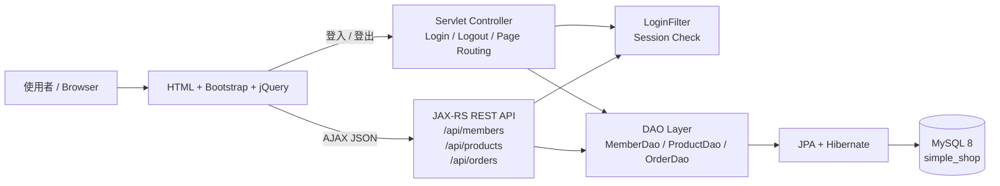

### 系統分層說明

| 層級 | 負責內容 | 專案位置 |
|---|---|---|
| View | 顯示頁面、表單、按鈕、資料表格 | `src/main/webapp/*.html` |
| Controller | 頁面導向、登入登出 | `backEnd.controller` |
| Filter | Session 權限檢查 | `backEnd.filter.LoginFilter` |
| REST API | JSON API，處理前端 AJAX 請求 | `backEnd.rest` |
| DAO | 封裝資料庫 CRUD 與交易控制 | `backEnd.dao`、`backEnd.dao.impl` |
| Entity | 對應 MySQL 資料表 | `backEnd.entity` |
| Utility | JPA、密碼 Hash、JSON 字串處理 | `backEnd.util` |
| Database | 儲存會員、商品、訂單資料 | MySQL `simple_shop` |

---

## 5. MVC 架構圖

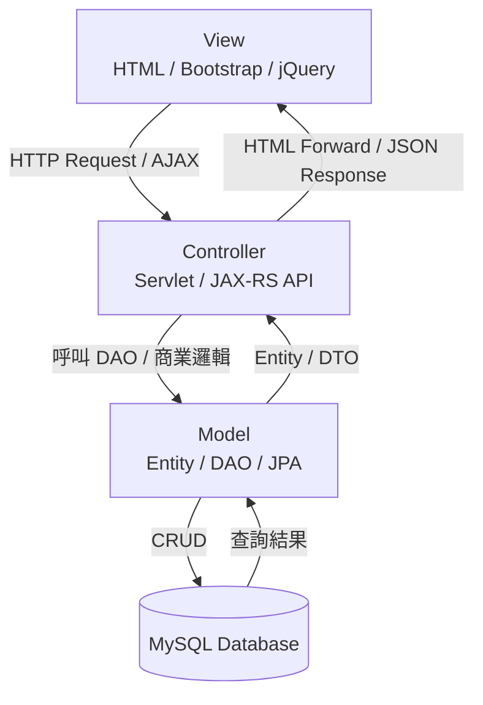

### MVC 對應表

| MVC | 專案對應 | 說明 |
|---|---|---|
| Model | `entity`、`dao`、`dao.impl`、`JpaUtil` | 負責資料結構、資料庫存取與交易 |
| View | `login.html`、`register.html`、`index.html`、`members.html`、`products.html`、`orders.html` | 負責畫面顯示與 AJAX 呼叫 |
| Controller | `controller` Servlet、`rest` JAX-RS API | 負責接收請求、呼叫 DAO、回傳頁面或 JSON |

---

## 6. ER Diagram（資料庫設計）

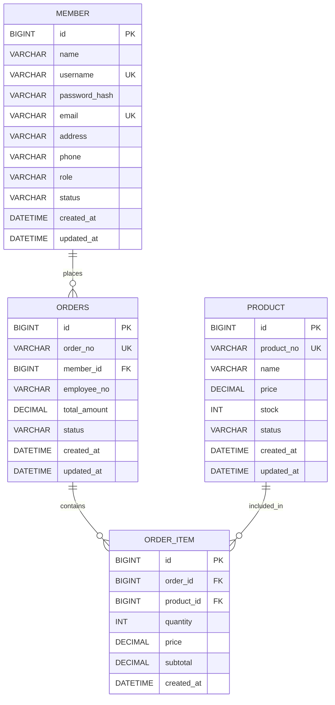

### 資料表關聯說明

| 關聯 | 說明 |
|---|---|
| `member 1 : N orders` | 一個會員可以建立多張訂單 |
| `orders 1 : N order_item` | 一張訂單可以包含多筆訂單明細 |
| `product 1 : N order_item` | 一個商品可以出現在多筆訂單明細中 |

---

## 7. 專案目錄結構

```text
SimpleShop_MavenWebProject
├─ pom.xml
├─ README.md
├─ ECLIPSE_FIXES.md
├─ database
│  └─ schema.sql
├─ docs
│  └─ images
│     ├─ login.png
│     ├─ products.png
│     └─ orders.png
└─ src
   └─ main
      ├─ java
      │  └─ backEnd
      │     ├─ controller
      │     │  ├─ LoginController.java
      │     │  ├─ MemberController.java
      │     │  ├─ ProductController.java
      │     │  └─ OrderController.java
      │     ├─ dao
      │     │  ├─ MemberDao.java
      │     │  ├─ ProductDao.java
      │     │  ├─ OrderDao.java
      │     │  └─ impl
      │     │     ├─ MemberDaoImpl.java
      │     │     ├─ ProductDaoImpl.java
      │     │     └─ OrderDaoImpl.java
      │     ├─ entity
      │     │  ├─ Member.java
      │     │  ├─ Product.java
      │     │  ├─ Orders.java
      │     │  └─ OrderItem.java
      │     ├─ filter
      │     │  └─ LoginFilter.java
      │     ├─ rest
      │     │  ├─ RestApplication.java
      │     │  ├─ MemberApi.java
      │     │  ├─ ProductApi.java
      │     │  ├─ OrderApi.java
      │     │  ├─ GenericExceptionMapper.java
      │     │  └─ ObjectMapperProvider.java
      │     └─ util
      │        ├─ JpaUtil.java
      │        ├─ JsonUtil.java
      │        └─ PasswordUtil.java
      ├─ resources
      │  └─ META-INF
      │     └─ persistence.xml
      └─ webapp
         ├─ WEB-INF
         │  └─ web.xml
         ├─ assets
         │  └─ js
         │     └─ common.js
         ├─ index.html
         ├─ login.html
         ├─ register.html
         ├─ members.html
         ├─ products.html
         └─ orders.html
```

---

## 8. 資料庫 Schema

Schema 檔案位置：

```text
database/schema.sql
```

完整 Schema：

```sql
CREATE DATABASE IF NOT EXISTS simple_shop
    DEFAULT CHARACTER SET utf8mb4
    DEFAULT COLLATE utf8mb4_unicode_ci;

USE simple_shop;

DROP TABLE IF EXISTS order_item;
DROP TABLE IF EXISTS orders;
DROP TABLE IF EXISTS product;
DROP TABLE IF EXISTS member;

CREATE TABLE member (
    id BIGINT PRIMARY KEY AUTO_INCREMENT,
    name VARCHAR(100) NOT NULL,
    username VARCHAR(100) NOT NULL UNIQUE,
    password_hash VARCHAR(255) NOT NULL,
    email VARCHAR(150) UNIQUE,
    address VARCHAR(255),
    phone VARCHAR(30),
    role VARCHAR(20) NOT NULL DEFAULT 'USER',
    status VARCHAR(20) NOT NULL DEFAULT 'ACTIVE',
    created_at DATETIME DEFAULT CURRENT_TIMESTAMP,
    updated_at DATETIME DEFAULT CURRENT_TIMESTAMP ON UPDATE CURRENT_TIMESTAMP
);

CREATE TABLE product (
    id BIGINT PRIMARY KEY AUTO_INCREMENT,
    product_no VARCHAR(50) NOT NULL UNIQUE,
    name VARCHAR(100) NOT NULL,
    price DECIMAL(10,2) NOT NULL,
    stock INT NOT NULL DEFAULT 0,
    status VARCHAR(20) NOT NULL DEFAULT 'ACTIVE',
    created_at DATETIME DEFAULT CURRENT_TIMESTAMP,
    updated_at DATETIME DEFAULT CURRENT_TIMESTAMP ON UPDATE CURRENT_TIMESTAMP
);

CREATE TABLE orders (
    id BIGINT PRIMARY KEY AUTO_INCREMENT,
    order_no VARCHAR(50) NOT NULL UNIQUE,
    member_id BIGINT NOT NULL,
    employee_no VARCHAR(50),
    total_amount DECIMAL(10,2) NOT NULL DEFAULT 0,
    status VARCHAR(20) NOT NULL DEFAULT 'NEW',
    created_at DATETIME DEFAULT CURRENT_TIMESTAMP,
    updated_at DATETIME DEFAULT CURRENT_TIMESTAMP ON UPDATE CURRENT_TIMESTAMP,
    FOREIGN KEY (member_id) REFERENCES member(id)
);

CREATE TABLE order_item (
    id BIGINT PRIMARY KEY AUTO_INCREMENT,
    order_id BIGINT NOT NULL,
    product_id BIGINT NOT NULL,
    quantity INT NOT NULL,
    price DECIMAL(10,2) NOT NULL,
    subtotal DECIMAL(10,2) NOT NULL,
    created_at DATETIME DEFAULT CURRENT_TIMESTAMP,
    FOREIGN KEY (order_id) REFERENCES orders(id),
    FOREIGN KEY (product_id) REFERENCES product(id)
);

INSERT INTO member (name, username, password_hash, email, address, phone, role, status)
VALUES
('系統管理員', 'admin', '03ac674216f3e15c761ee1a5e255f067953623c8b388b4459e13f978d7c846f4', 'admin@example.com', 'Taipei', '0911111111', 'ADMIN', 'ACTIVE'),
('測試會員', 'user', '03ac674216f3e15c761ee1a5e255f067953623c8b388b4459e13f978d7c846f4', 'user@example.com', 'Taipei', '0922222222', 'USER', 'ACTIVE');

INSERT INTO product (product_no, name, price, stock, status)
VALUES
('P001', 'Java 入門書', 550.00, 20, 'ACTIVE'),
('P002', 'MySQL 練習本', 480.00, 15, 'ACTIVE'),
('P003', 'Bootstrap 範例包', 300.00, 30, 'ACTIVE');
```

### 預設登入帳號

| 角色 | 帳號 | 密碼 | 說明 |
|---|---|---|---|
| 管理員 | `admin` | `1234` | 預設 role 為 `ADMIN` |
| 測試會員 | `user` | `1234` | 預設 role 為 `USER` |

> 目前系統主要判斷是否登入，`role` 欄位已保留，後續可以擴充成更完整的角色權限控管。

---

## 9. 安裝與執行方式

### 9.1 環境需求

請先安裝：

- JDK 17
- Eclipse IDE for Enterprise Java and Web Developers
- Apache Tomcat 10.1 或 TomEE 10.1
- MySQL 8.0
- Maven

---

### 9.2 匯入 Eclipse

1. 開啟 Eclipse。
2. 選擇 `File` → `Import`。
3. 選擇 `Maven` → `Existing Maven Projects`。
4. 選擇 `SimpleShop_MavenWebProject` 專案資料夾。
5. 勾選 `pom.xml`。
6. 按下 `Finish`。
7. 匯入後右鍵專案，選擇 `Maven` → `Update Project...`。
8. 勾選 `Force Update of Snapshots/Releases` 後按 `OK`。
9. 執行 `Project` → `Clean...`。

---

### 9.3 建立 MySQL 資料庫

使用 MySQL Workbench、DBeaver 或命令列執行：

```text
database/schema.sql
```

執行後會建立資料庫：

```text
simple_shop
```

---

### 9.4 修改資料庫連線

檔案位置：

```text
src/main/resources/META-INF/persistence.xml
```

請依照自己的 MySQL 設定修改帳號密碼：

```xml
<property name="jakarta.persistence.jdbc.url" value="jdbc:mysql://localhost:3306/simple_shop?useSSL=false&amp;allowPublicKeyRetrieval=true&amp;serverTimezone=Asia/Taipei&amp;characterEncoding=utf8"/>
<property name="jakarta.persistence.jdbc.user" value="root"/>
<property name="jakarta.persistence.jdbc.password" value="你的 MySQL 密碼"/>
```

> 安全提醒：如果要上傳 GitHub，建議不要提交真實密碼，可以改成範例密碼或環境變數設定。

---

### 9.5 部署到 Tomcat / TomEE

1. Eclipse 開啟 `Servers` 視窗。
2. 新增 Apache Tomcat 10.1 或 TomEE 10.1。
3. 專案右鍵 → `Run As` → `Run on Server`。
4. 選擇剛建立的 Server。
5. 啟動後開啟：

```text
http://localhost:8080/SimpleShop_MavenWebProject/login.html
```

---

### 9.6 常用測試網址

| 功能 | URL |
|---|---|
| 登入頁 | `http://localhost:8080/SimpleShop_MavenWebProject/login.html` |
| 註冊頁 | `http://localhost:8080/SimpleShop_MavenWebProject/register.html` |
| 首頁 | `http://localhost:8080/SimpleShop_MavenWebProject/index.html` |
| 會員管理 | `http://localhost:8080/SimpleShop_MavenWebProject/members.html` |
| 商品管理 | `http://localhost:8080/SimpleShop_MavenWebProject/products.html` |
| 訂單管理 | `http://localhost:8080/SimpleShop_MavenWebProject/orders.html` |
| 會員 API | `http://localhost:8080/SimpleShop_MavenWebProject/api/members` |
| 商品 API | `http://localhost:8080/SimpleShop_MavenWebProject/api/products` |
| 訂單 API | `http://localhost:8080/SimpleShop_MavenWebProject/api/orders` |

---

## 10. 系統畫面

### 10.1 登入畫面

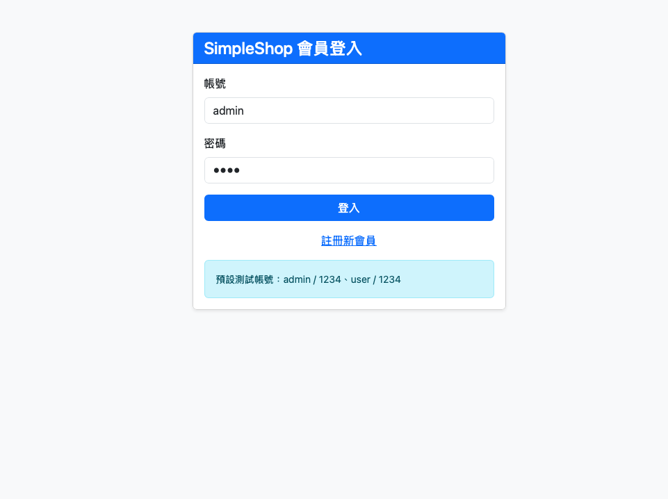

登入頁提供帳號密碼輸入，登入成功後會建立 Session，並導向系統首頁。

### 10.2 商品管理畫面

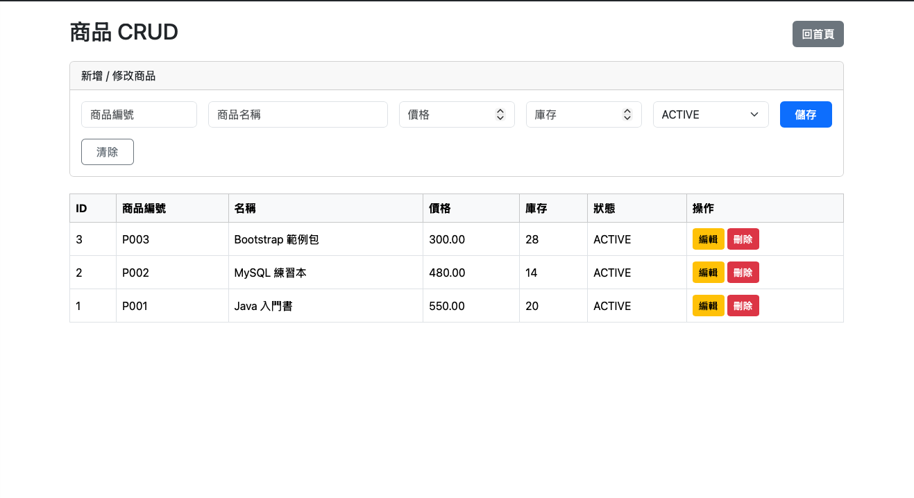

商品管理頁可透過 AJAX 呼叫 `/api/products`，完成商品新增、查詢、修改、刪除。

### 10.3 訂單管理畫面

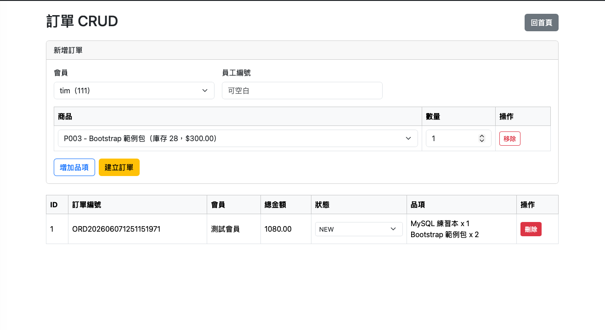

訂單管理頁可建立訂單、查詢訂單、修改訂單狀態與刪除訂單。

---

## 11. 功能流程圖

### 11.1 登入流程

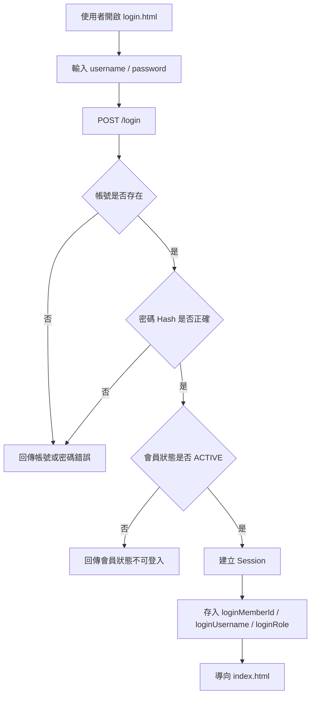

### 11.2 Session 權限控管流程

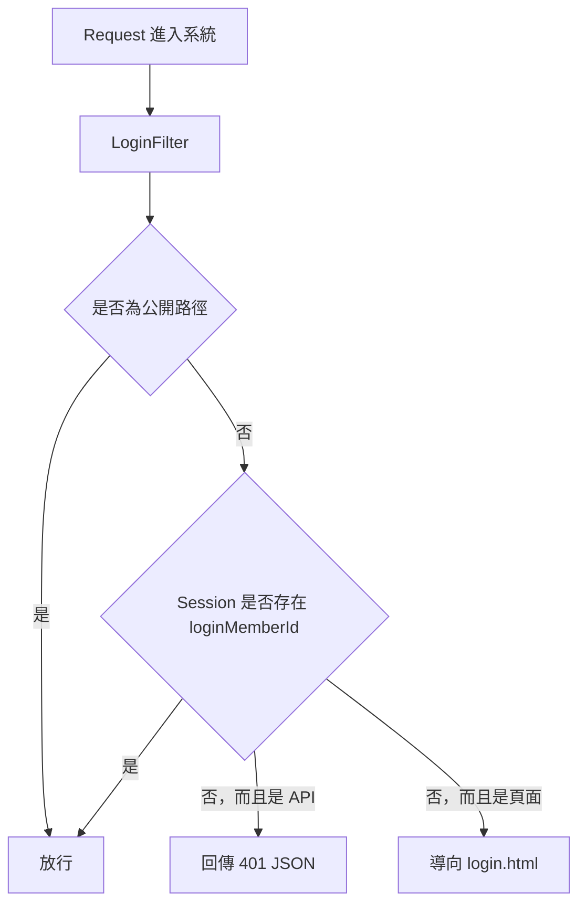

### 11.3 商品 CRUD 流程

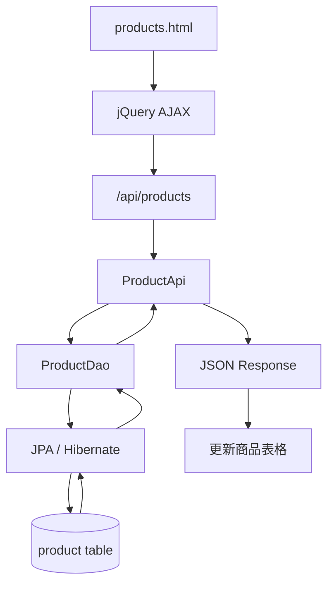

### 11.4 建立訂單流程

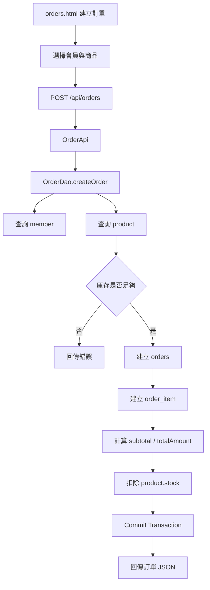

### 11.5 會員註冊流程

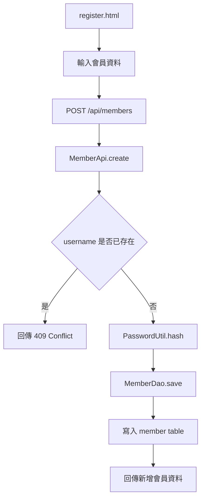

---

## 12. API 文件

Base URL：

```text
http://localhost:8080/SimpleShop_MavenWebProject/api
```

受保護 API 需要先登入；未登入呼叫 `/api/*` 會由 `LoginFilter` 回傳 401 JSON。

---

### 12.1 Login / Logout Servlet

#### 登入

```http
POST /login
Content-Type: application/x-www-form-urlencoded
```

Request：

```text
username=admin&password=1234
```

Response：

```json
{
  "success": true,
  "message": "登入成功",
  "username": "admin",
  "role": "ADMIN"
}
```

#### 登出

```http
GET /logout
```

---

### 12.2 Member API

| Method | Path | 功能 |
|---|---|---|
| GET | `/api/members` | 查詢全部會員 |
| GET | `/api/members/{id}` | 查詢單一會員 |
| POST | `/api/members` | 新增會員 / 註冊會員 |
| PUT | `/api/members/{id}` | 修改會員 |
| DELETE | `/api/members/{id}` | 刪除會員 |

#### 新增會員 Request

```json
{
  "name": "王小明",
  "username": "ming",
  "password": "1234",
  "email": "ming@example.com",
  "address": "Taipei",
  "phone": "0933333333",
  "role": "USER",
  "status": "ACTIVE"
}
```

#### 會員 Response

```json
{
  "id": 1,
  "name": "系統管理員",
  "username": "admin",
  "email": "admin@example.com",
  "address": "Taipei",
  "phone": "0911111111",
  "role": "ADMIN",
  "status": "ACTIVE",
  "createdAt": "2026-06-07T10:00:00",
  "updatedAt": "2026-06-07T10:00:00"
}
```

> 修改會員時，如果 `password` 空白，代表不修改密碼。

---

### 12.3 Product API

| Method | Path | 功能 |
|---|---|---|
| GET | `/api/products` | 查詢全部商品 |
| GET | `/api/products/{id}` | 查詢單一商品 |
| POST | `/api/products` | 新增商品 |
| PUT | `/api/products/{id}` | 修改商品 |
| DELETE | `/api/products/{id}` | 刪除商品 |

#### 新增商品 Request

```json
{
  "productNo": "P004",
  "name": "Servlet 教學書",
  "price": 620.00,
  "stock": 10,
  "status": "ACTIVE"
}
```

#### 商品 Response

```json
{
  "id": 1,
  "productNo": "P001",
  "name": "Java 入門書",
  "price": 550.00,
  "stock": 20,
  "status": "ACTIVE",
  "createdAt": "2026-06-07T10:00:00",
  "updatedAt": "2026-06-07T10:00:00"
}
```

---

### 12.4 Order API

| Method | Path | 功能 |
|---|---|---|
| GET | `/api/orders` | 查詢全部訂單 |
| GET | `/api/orders/{id}` | 查詢單一訂單 |
| POST | `/api/orders` | 建立訂單 |
| PUT | `/api/orders/{id}/status` | 修改訂單狀態 |
| DELETE | `/api/orders/{id}` | 刪除訂單 |

#### 建立訂單 Request

```json
{
  "memberId": 1,
  "employeeNo": "E001",
  "items": [
    {
      "productId": 1,
      "quantity": 2
    },
    {
      "productId": 2,
      "quantity": 1
    }
  ]
}
```

#### 建立訂單 Response

```json
{
  "id": 1,
  "orderNo": "ORD202606071200001234",
  "memberId": 1,
  "memberName": "系統管理員",
  "employeeNo": "E001",
  "totalAmount": 1580.00,
  "status": "NEW",
  "items": [
    {
      "id": 1,
      "productId": 1,
      "productName": "Java 入門書",
      "quantity": 2,
      "price": 550.00,
      "subtotal": 1100.00
    },
    {
      "id": 2,
      "productId": 2,
      "productName": "MySQL 練習本",
      "quantity": 1,
      "price": 480.00,
      "subtotal": 480.00
    }
  ]
}
```

#### 修改訂單狀態 Request

```json
{
  "status": "PAID"
}
```

---

## 13. 遇到的問題與解決方案

### 13.1 `/api/members` 出現 404

**問題：** 頁面可以開啟，但 AJAX 呼叫 `/api/members` 出現 404。

**原因：** Tomcat 10.1 不會自動提供 JAX-RS runtime，需要加入 Jersey 並在 `web.xml` 設定 `/api/*`。

**解法：** 在 `pom.xml` 加入 Jersey 相關依賴，並在 `WEB-INF/web.xml` 設定 `ServletContainer`：

```xml
<servlet>
    <servlet-name>Jersey REST API</servlet-name>
    <servlet-class>org.glassfish.jersey.servlet.ServletContainer</servlet-class>
    <init-param>
        <param-name>jersey.config.server.provider.packages</param-name>
        <param-value>backEnd.rest</param-value>
    </init-param>
    <load-on-startup>1</load-on-startup>
</servlet>

<servlet-mapping>
    <servlet-name>Jersey REST API</servlet-name>
    <url-pattern>/api/*</url-pattern>
</servlet-mapping>
```

---

### 13.2 `LocalDateTime` 無法轉 JSON

**問題：** API 回傳 `createdAt`、`updatedAt` 時發生 Java time JSON 轉換錯誤。

**原因：** Jackson 需要 JavaTimeModule 才能處理 `LocalDateTime`。

**解法：** 加入 `jackson-datatype-jsr310`，並建立 `ObjectMapperProvider` 註冊 `JavaTimeModule`。

---

### 13.3 `persistence.xml` schema 版本錯誤

**問題：** Eclipse 顯示：

```text
Value '3.1' of attribute 'version' of element 'persistence' is not valid.
```

**原因：** `persistence_3_0.xsd` 的固定版本值是 `3.0`，如果 XML 使用該 XSD，就應讓 `version="3.0"` 與 schema 對齊。

**解法：**

```xml
<persistence xmlns="https://jakarta.ee/xml/ns/persistence"
             xmlns:xsi="http://www.w3.org/2001/XMLSchema-instance"
             xsi:schemaLocation="https://jakarta.ee/xml/ns/persistence https://jakarta.ee/xml/ns/persistence/persistence_3_0.xsd"
             version="3.0">
```

---

### 13.4 `web.xml` 顯示 Cannot find declaration of element `web-app`

**問題：** Eclipse XML Validator 顯示：

```text
cvc-elt.1.a: Cannot find the declaration of element 'web-app'.
```

**解法：** 使用 Jakarta EE 10 / Servlet 6.0 對應 schema：

```xml
<web-app xmlns="https://jakarta.ee/xml/ns/jakartaee"
         xmlns:xsi="http://www.w3.org/2001/XMLSchema-instance"
         xsi:schemaLocation="https://jakarta.ee/xml/ns/jakartaee https://jakarta.ee/xml/ns/jakartaee/web-app_6_0.xsd"
         version="6.0">
```

如果專案可正常執行但 Eclipse 仍誤判，可在專案層級關閉 XML Validator。

---

### 13.5 JPA Validator 誤判 Entity 沒有 Annotation

**問題：** Eclipse 顯示：

```text
Class "backEnd.entity.Member" is listed in the persistence.xml file, but is not annotated
```

但 `Member.java` 實際上已經有：

```java
import jakarta.persistence.Entity;

@Entity
public class Member {
}
```

**原因：** Eclipse JPA Validator 對 Jakarta Persistence / `jakarta.persistence.*` 有時會誤判。

**解法：** 關閉該專案的 JPA Validator：

```text
右鍵專案 → Properties → Validation → JPA Validator
Manual 取消勾選
Build 取消勾選
Apply and Close
Project → Clean
```

---

### 13.6 `.classpath` 綁定不存在的 Server Runtime

**問題：** Eclipse 顯示 Target runtime 不存在，例如：

```text
Apache Tomcat v10.1 is not defined
```

**原因：** `.classpath` 或 Eclipse 專案設定綁定了某一台電腦上的 server runtime 名稱。

**解法：** 移除 `.classpath` 裡的固定 runtime entry，改由 Maven dependency 與 Eclipse Targeted Runtimes 管理。

---

### 13.7 Tomcat Reload 時出現 MySQL / Hibernate memory leak warning

**問題：** Reload 專案時出現：

```text
mysql-cj-abandoned-connection-cleanup failed to stop
Hibernate Connection Pool Validation Thread failed to stop
```

**原因：** Web application reload 時，`EntityManagerFactory` 或 MySQL cleanup thread 沒有正常釋放。

**解法方向：** `JpaUtil` 已提供 `close()`，可再新增 `ServletContextListener`，在 `contextDestroyed()` 中呼叫 `JpaUtil.close()`，必要時呼叫 MySQL cleanup shutdown。

---

## 14. 未來優化方向

- **角色權限控管**：讓 `ADMIN` 可管理會員、商品與訂單，`USER` 只能查看商品與自己的訂單。
- **BCrypt 密碼加密**：取代 SHA-256，讓密碼儲存更接近正式系統。
- **忘記密碼流程**：加入 reset token、Email 驗證、密碼重設頁面。
- **Service Layer**：在 Controller/API 與 DAO 中間加入 Service，集中商業邏輯。
- **表單驗證強化**：前端與後端都加入更完整 validation。
- **分頁與搜尋**：會員、商品、訂單列表加入 pagination 與 keyword search。
- **訂單狀態流程**：加入 `NEW → PAID → SHIPPED → COMPLETED → CANCELLED` 狀態轉換限制。
- **庫存交易安全**：處理多人同時下單時的庫存一致性，例如 optimistic locking 或悲觀鎖。
- **軟刪除**：刪除會員或商品時改成更新 `status`，保留歷史資料。
- **OpenAPI / Swagger UI**：讓 API 文件可以自動化產生與測試。
- **JUnit / Mockito 測試**：加入 DAO、API、登入流程測試。
- **Spring Boot 版本**：改寫成 Spring Boot + Spring Data JPA + Spring Security。
- **Docker 化**：加入 Dockerfile 與 docker-compose，一鍵啟動 Tomcat + MySQL。
- **AWS 部署**：部署到 AWS EC2 / Elastic Beanstalk，資料庫改用 AWS RDS MySQL。

---

## 15. 個人學習收穫

透過本專案，我練習並理解 Java Web 系統從前端、後端到資料庫的完整開發流程：

1. 理解 Maven Web Project 的標準目錄、依賴管理與 WAR 部署方式。
2. 理解 Servlet 如何處理登入、登出、Session 與頁面導向。
3. 理解 Filter 如何在請求進入系統前進行登入檢查。
4. 理解 RESTful API 的設計方式，包含 GET、POST、PUT、DELETE。
5. 理解 jQuery AJAX 如何與後端 API 串接並更新畫面。
6. 理解 JPA Entity 與 MySQL 資料表之間的對應關係。
7. 理解 DAO Pattern 如何封裝資料庫 CRUD 操作。
8. 理解會員、商品、訂單、訂單明細之間的資料表關聯。
9. 理解密碼不應儲存明文，而應儲存 password hash。
10. 理解 Tomcat 與 TomEE 在 Jakarta EE / JAX-RS 支援上的差異。
11. 理解 Jackson 處理 `LocalDateTime` 時需要 JavaTimeModule。
12. 理解 Eclipse 對 Jakarta EE 專案可能出現 Validator 誤判，需要判斷哪些是真錯、哪些是 IDE 驗證問題。
13. 理解 Dynamic Web Project 轉成 Maven Web Project 時，`pom.xml`、`.classpath`、`.project`、facet、server runtime 與 deployment 設定都需要一致。

本專案雖然是簡易購物系統，但涵蓋 Java Web 後端常見核心觀念，包括 MVC、DAO、REST API、Session、JPA、MySQL、AJAX 與權限控管，是後續學習 Spring Boot、Spring Security、雲端部署與高併發交易系統的重要基礎。
